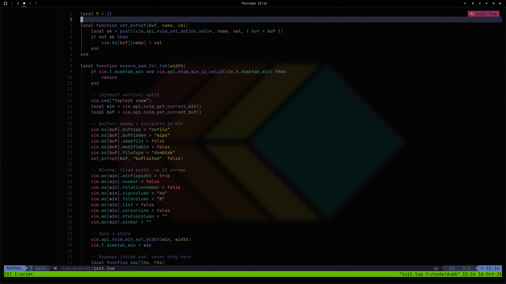

# dumbtab

A Neovim plugin that adds **persistent left padding** to the editing view.

## What’s the problem?

On wide and ultra-wide displays (especially when the editor is fullscreen), code often begins at the far left edge of the screen.  
That edge-hugging layout can be uncomfortable; a slightly right-shifted focal area is often easier on the eyes and neck.

## How it solves it

<p align="center">
  
</p>

`dumbtab.nvim` opens a small, fixed-width, non-editable window on the left and keeps it there.  
The actual editing window remains to the right, creating a soft, always-present visual margin.

## Not a definitive solution (aka gambiarra)

This plugin is intentionally a **gambiarra** (Brazilian Portuguese word for a clever, improvised fix that isn’t the “proper” solution, but it works!).  
For a quick sense of the concept, pictures of “gambiarra” on the internet convey the idea immediately!

## How it compares to Zen-mode plugin

`folke/zen-mode.nvim` is a polished, purpose-built focus tool: excellent for distraction-free, single-buffer work (often using a centered or floating layout) and packed with thoughtful integrations.  
`dumbtab.nvim` is a **temporary** workaround that provides a left padding margin across **multiple splits/tabs**, survives **pane** open/close and remains compatible with **Neo-tree**.

Both plugins can be combined: `folke/zen-mode.nvim` offers an elegant, distraction-free single-buffer experience when needed, while `dumbtab.nvim` provides a provisional left margin for multi-split editing.

## Downsides & caveats (why it's a temporary solution)

- Uses a real **window** as padding (not a true layout/gutter feature).
- May appear in buffer/tab UIs; marked unlisted, but some UIs may still show it.
- Window navigation and `:q` semantics can feel awkward; focus may land on the padding window.

## Commands

- `:DumbtabToggle` - toggles the left padding.

## Installation

Using [lazy.nvim](https://github.com/folke/lazy.nvim):

```
{
  "aiamlucas/dumbtab",
  main = "dumbtab",
  lazy = false,
  priority = 1000,
  opts = {
    width = 20,       -- left padding (columns)
    enabled = false,  -- start with padding OFF
  },
}
```

## Keybinding

No default keymaps are set.

Example mappings:
map **`<leader>um`** (Space → u → m) to toggle the margin
In lua/config/keymaps.lua (or similar)

```
vim.keymap.set("n", "<leader>um", "<cmd>DumbtabToggle<CR>", {
  silent = true,
  desc = "Toggle left margin (dumbtab)",
})
```
